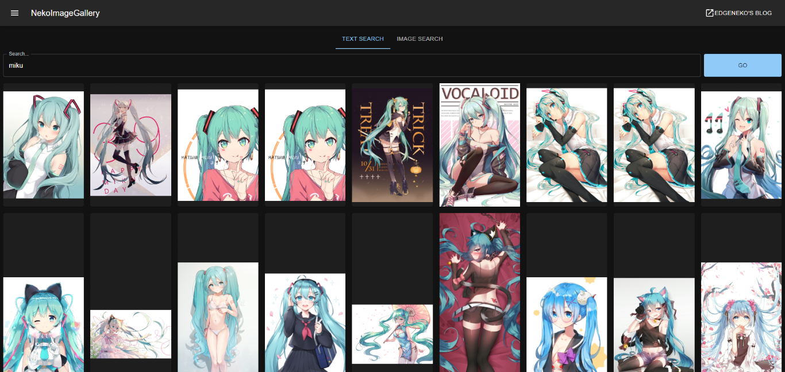
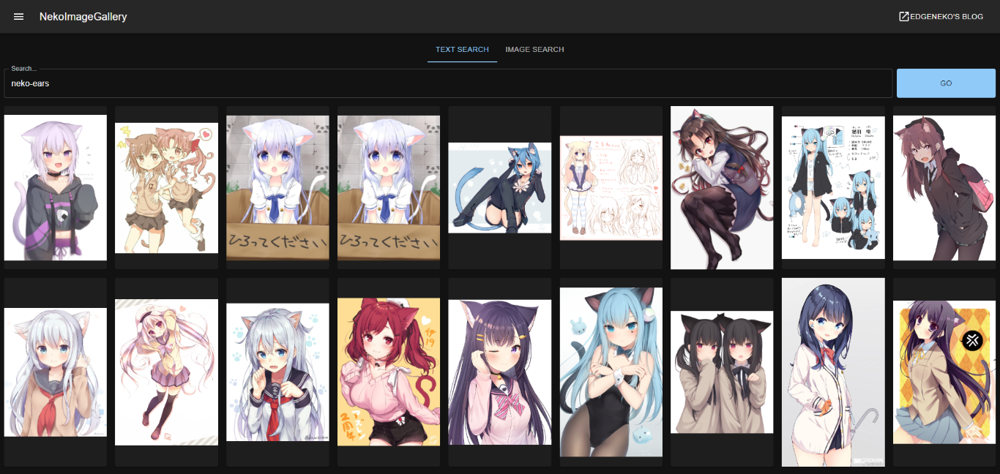
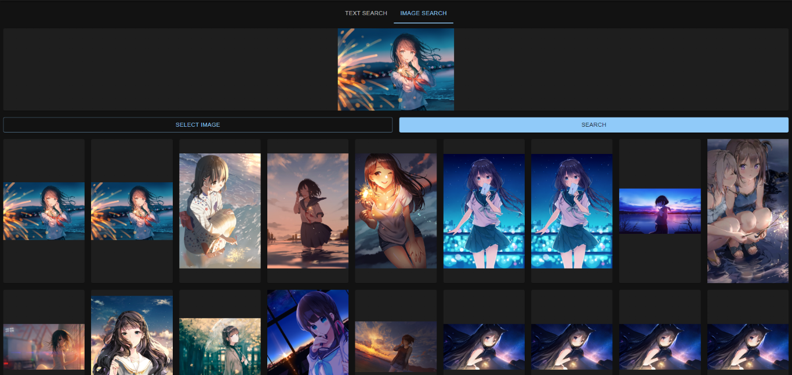
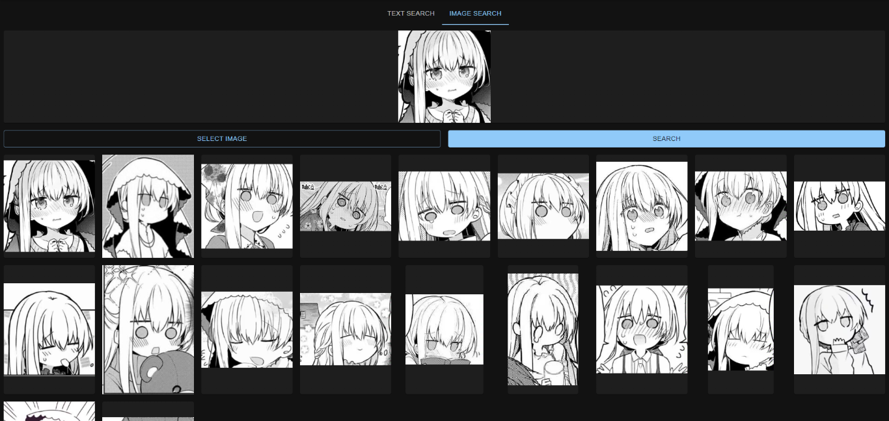

# NekoImageGallery

基于Clip模型与Qdrant向量数据库的在线AI图片搜索引擎。支持关键字搜索以及相似图片搜索。

[English Document](readme.md)

## ✨特性

- 使用Clip模型为每张图片生成768维向量作为搜索依据。无需人工标注或分类，无限分类类别。
- 使用Qdrant向量数据库进行高效的向量搜索。

## 📷截图






> 以上截图可能包含来自不同画师的版权图片，请不要将其用作其它用途。


## ✈️部署

### 本地部署
#### 部署Qdrant数据库

请根据[Qdrant文档](https://qdrant.tech/documentation/quick-start/)部署Qdrant数据库，推荐使用docker部署。

如果你不想自己部署Qdrant，可以使用[Qdrant官方提供的在线服务](https://qdrant.tech/documentation/cloud/)。

#### 部署NekoImageGallery
1. 将项目目录clone到你自己的PC或服务器中。
2. 强烈建议在python venv虚拟环境中安装本项目所需依赖， 运行下面命令：
    ```shell
    python -m venv .venv
    . .venv/bin/activate
    ```
3. 安装PyTorch. 按照[PyTorch文档](https://pytorch.org/get-started/locally/)使用pip安装适合你的系统的torch版本
   > 如果您希望使用CUDA加速推理，务必在本步中安装支持Cuda的pytorch版本，安装完成后可以使用`torch.cuda.is_available()`确认CUDA是否可用。
4. 安装其它本项目所需依赖：
    ```shell
    pip install -r requirements.txt
    ```
5. 按需修改位于`config`目录下的配置文件，您可以直接修改`default.env`，但是建议创建一个名为`local.env`的文件，覆盖`default.env`中的配置。
6. 初始化Qdrant数据库，运行下面命令：
    ```shell
    python main.py --init-database
    ```
   此操作将会在Qdrant数据库中创建一个名字与`config.QDRANT_COLL`相同的collection，用于存储图片向量。
7. (可选)在开发部署与小规模部署中，可以使用本应用自带的静态文件索引与服务功能。使用下面命令索引您本地的图片目录：
    ```shell
   python main.py --local-index <path-to-your-image-directory>
    ```
   此操作会将位于`<path-to-your-image-directory>`目录下的所有图片文件复制到`config.STATIC_FILE_PATH`目录下(默认为`./static`)，并将图片信息写入Qdrant数据库。
   
   然后运行下面的命令，为所有static目录下的图片生成缩略图：

   ```shell
    python main.py --local-create-thumbnail
   ```
   
   如果你希望大规模部署，可以使用类似`MinIO`的OSS存储服务，将图片文件存储在OSS中，然后将图片信息写入Qdrant数据库即可。
8. 运行本应用：
    ```shell
    python main.py
    ```
   你可以通过`--host`指定希望绑定到的ip地址(默认为0.0.0.0)，通过`--port`指定希望绑定到的端口(默认为8000)。
9. (可选)部署前端应用：[NekoImageGallery.App](https://github.com/hv0905/NekoImageGallery.App)是本项目的一个简易web前端应用，如需部署请参照它的[部署文档](https://github.com/hv0905/NekoImageGallery.App)。

### Docker Compose容器化部署

WIP

## Copyright

Copyright 2023 EdgeNeko

Licensed under GPLv3 license.